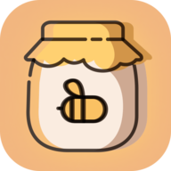
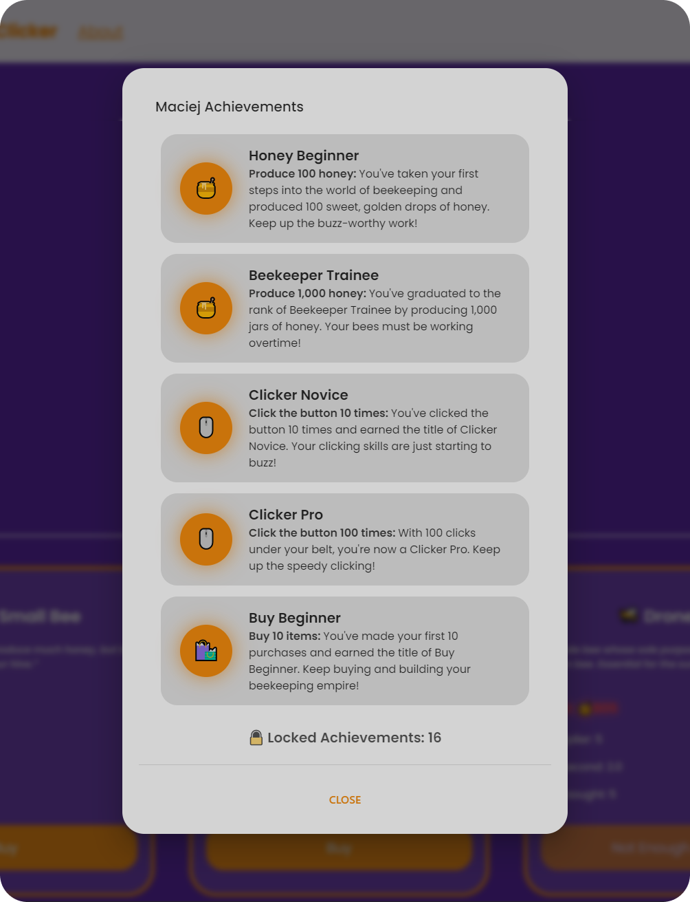
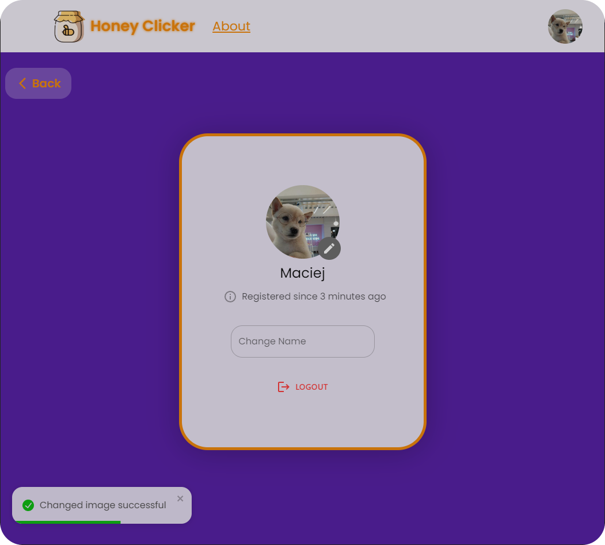

# [Honey Clicker Game](https://honey-clicker-game.netlify.app/)

Welcome to Honey Clicker! This is a simple yet addictive clicker game where you can earn points by clicking on a honey jar. You can use your points to upgrade your clicking power, earn more points per second, and unlock achievements. Your progress is saved in localstorage, so you can resume your game anytime. Read more at [https://honey-clicker-game.netlify.app/about](https://honey-clicker-game.netlify.app/about)

## ⚡ Features

- Progress is saved in localstorage
- Purchase various items in the shop to increase your clicking power
- Unlock achievements with interesting descriptions by reaching certain goals
- User profile settings where you can change your name and profile picture
- Cool sound effects and volume slider
- Responsive design that adapts to different screen sizes

## 📷 Screenshots

## 🌐 Technologies

Project is created with:

- React
- Typescript
- Vite
- Mui
- styled-components
- react-toastify

## ⚙️ Installation

To install and run the project locally, follow these steps:

- Clone the repository: `git clone https://github.com/maciekt07/clicker-game.git`
- Navigate to the project directory: `cd clicker-game`
- Install the dependencies: `npm install`
- Start the development server: `npm run dev`

The game will now be running at [http://localhost:5173/](http://localhost:5173/).

## 🧡 Feedback

If you have any feedback or suggestions for this game, feel free to open an issue or a pull request on GitHub. I appreciate any kind of contribution or support.
